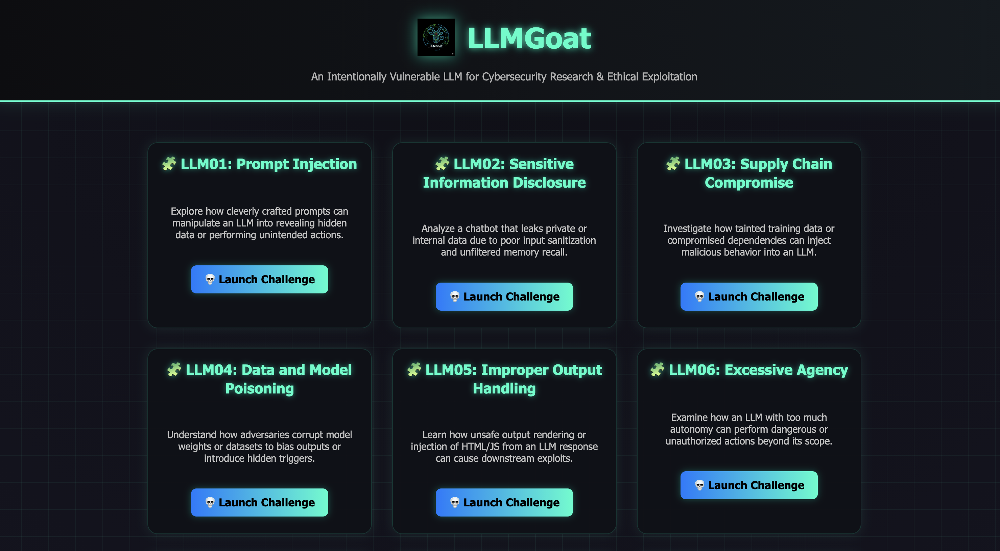

# LLMGoat: Offensive LLM Security Environment

## 🛡️ Project Description

With the rapid adoption of LLMs in real-world applications, developers and security teams often underestimate novel attack surfaces unique to these models, such as prompt injection, data poisoning, or models leaking sensitive information.

LLMGoat provides a hands-on, gamified environment where practitioners can exploit and observe these attacks safely, helping them understand the practical risks, attack chains, and real-world consequences before deploying LLMs in production.

LLMGoat is a gamified, hands-on exploit environment that teaches offensive LLM security through real-world scenarios mapped directly to the OWASP LLM Top 10.

## Covered OWASP LLM Top 10

LLM01: Prompt Injection

LLM02: Sensitive Information Disclosure

LLM03: Supply Chain

LLM04: Data and Model Poisoning

LLM05: Improper Output Handling

LLM06: Excessive Agency

LLM07: System Prompt Leakage

LLM08: Vector and Embedding Weaknesses

LLM09: Misinformation

LLM10: Unbounded Consumption

This is a compact, gamified environment featuring 10 core exploitation challenges and multiple bonus challenges covering advanced attack techniques. Each challenge is a real-world scenario where the player exploits, observes, and measures the impact of an LLM-centric attack.


## 🚀 Deployment Steps

Follow these steps to set up and run the LLMGoat environment locally.

**Prerequisite:**

- You must have Ollama installed and running in the background.

- Pull the necessary model: ```ollama pull mistral```

**Setup and Run:**

1. Move to the app folder:

```
cd app
```

2. Create a Python Virtual Environment (venv):

```
python3.12 -m venv venv
```

3. Activate the Virtual Environment:

```
source venv/bin/activate
```

4. Install Required Dependencies: (Ensure you have a requirements.txt file in your root directory)

```
pip3 install -r requirements.txt
```

5. Run the Application:

```
python3 app.py
```

The application should now be running and accessible via your local browser at http://127.0.0.1:8000.



**Note: This project is actively under development, and new features and improvements are being added regularly.**

---