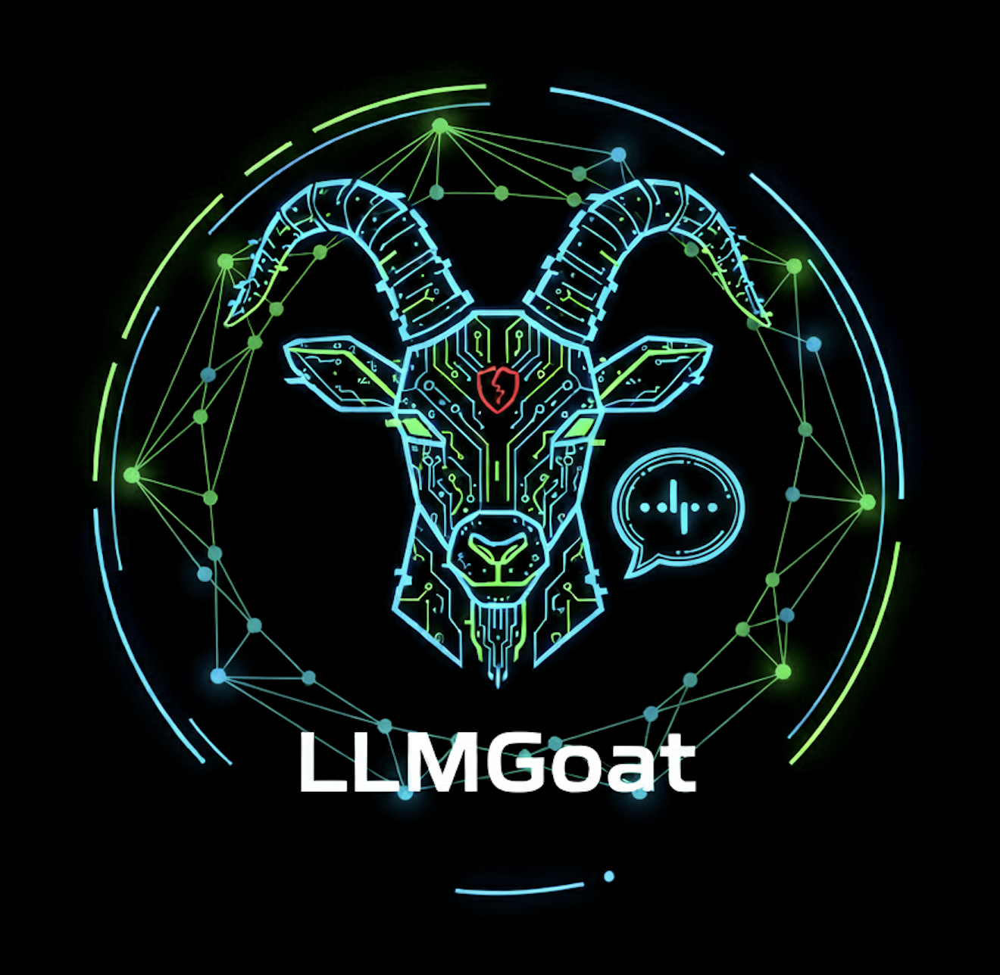
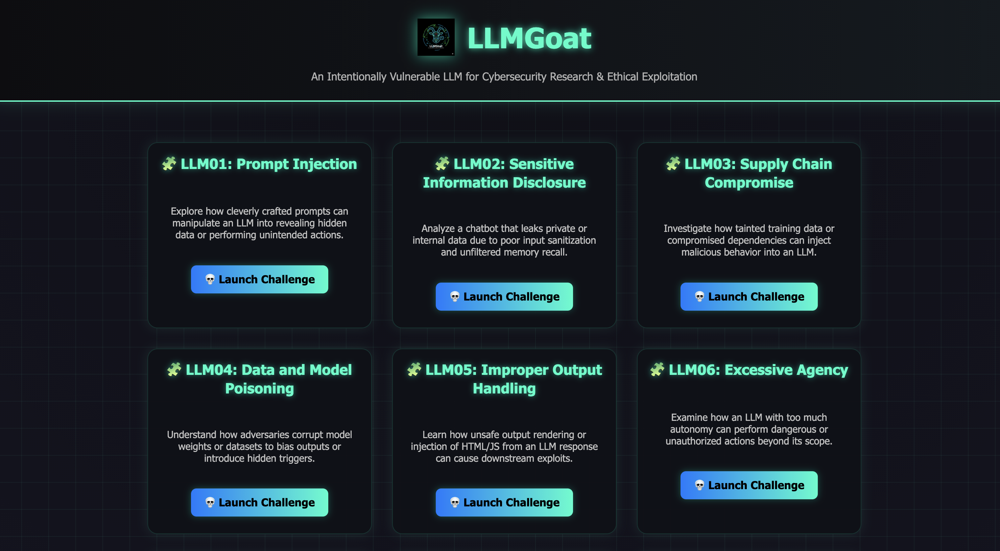

<div align="center">
  

  <h1>LLMGoat</h1>
  <p><strong>Offensive LLM Security — Learn by Exploiting</strong></p>

  <p>
    
    
    
    
  </p>

  <p>
    <a href="https://www.youtube.com/watch?v=LFmyKLSi3aY">🎥 Watch Demo</a> •
    <a href="#-deployment-steps">🚀 Get Started</a> •
    <a href="#-owasp-llm-top-10-challenges">📋 Challenges</a>
  </p>
</div>

---

## What is LLMGoat?

LLMGoat is a **gamified, hands-on exploitation environment** for learning offensive LLM security. As LLMs get rapidly adopted in production, developers and security teams often underestimate attack surfaces unique to these models — prompt injection, data poisoning, system prompt leakage, and more.

LLMGoat lets you **safely exploit, observe, and measure** the impact of these attacks in realistic scenarios — so you understand the risks before they hit production.

> **10 core challenges**, each mapped directly to the [OWASP LLM Top 10](https://owasp.org/www-project-top-10-for-large-language-model-applications/).

---

## 🎥 Demo

[](https://www.youtube.com/watch?v=LFmyKLSi3aY)



---

## 📋 OWASP LLM Top 10 Challenges

| # | Vulnerability | Description |
|---|--------------|-------------|
| LLM01 | **Prompt Injection** | Manipulate the model's behavior by injecting adversarial instructions |
| LLM02 | **Sensitive Information Disclosure** | Trick the model into revealing confidential or private data |
| LLM03 | **Supply Chain** | Exploit vulnerabilities in third-party LLM components or pipelines |
| LLM04 | **Data and Model Poisoning** | Corrupt training data or fine-tuning to alter model behavior |
| LLM05 | **Improper Output Handling** | Exploit unsafe handling of LLM-generated output downstream |
| LLM06 | **Excessive Agency** | Abuse over-permissioned LLM agents to take unintended actions |
| LLM07 | **System Prompt Leakage** | Extract hidden system-level instructions from the model |
| LLM08 | **Vector and Embedding Weaknesses** | Attack RAG pipelines via embedding manipulation |
| LLM09 | **Misinformation** | Cause the model to generate and spread false or harmful content |
| LLM10 | **Unbounded Consumption** | Exploit resource exhaustion or runaway inference costs |

---

## 🚀 Deployment Steps

### Prerequisites

- [Ollama](https://ollama.com/) installed and running
- Python 3.12

**Pull the required models:**
```bash
# LLM for inference
ollama pull mistral

# Embedding model (all-MiniLM-L6-v2) — downloaded automatically via gpt4all on first run
# No manual download needed
```

### Setup

```bash
# 1. Move into the app directory
cd app

# 2. Create a virtual environment
python3.12 -m venv venv

# 3. Activate it
source venv/bin/activate          # macOS / Linux
# venv\Scripts\activate           # Windows

# 4. Install dependencies
pip3 install -r requirements.txt

# 5. Run the app
python3 app.py
```

Open your browser at **http://127.0.0.1:8000** and start exploiting.

---

## 🐳 Docker Setup

> Ollama must be running on your **host machine** — do not run Ollama inside Docker. The container reaches it automatically via `host.docker.internal:11434`.

**Step 1 — Start Ollama and pull Mistral on your host:**

```bash
ollama serve
ollama pull mistral
```

**Step 2 — Build and run:**

```bash
docker compose up --build
```

Open your browser at **http://localhost:8000**.

> **Note:** The first startup downloads the embedding model (~46 MB). This is cached in a Docker volume so subsequent starts are instant.

### Platform compatibility

| Platform | Status |
|---|---|
| macOS (Apple Silicon) | ✅ Works via Rosetta emulation |
| macOS (Intel) | ✅ Native |
| Windows (x86) | ✅ Native |
| Linux (x86_64) | ✅ Native |

---

## 🗂️ Project Structure

```
LLMGoat/
├── app/
│   ├── app.py              # Main application entry point
│   ├── requirements.txt    # Python dependencies
│   ├── llms/               # LLM integrations and configurations
│   ├── embeddings/         # Cached embedding vectors
│   ├── templates/          # HTML challenge templates
│   └── static/             # Static assets (CSS, JS)
├── assets/                 # Images and media
├── solution-manuals/       # Step-by-step challenge walkthroughs
├── Dockerfile
├── docker-compose.yml
└── readme.md
```

---

## 📖 Solution Manuals

Step-by-step walkthroughs are available for each challenge in the [solution-manuals/](./solution-manuals/) directory.

| Challenge | Walkthrough |
|-----------|-------------|
| LLM01: Prompt Injection | [View](./solution-manuals/prompt-injection.md) |
| LLM02: Sensitive Information Disclosure | [View](./solution-manuals/sensitive-info-disclosure.md) |
| LLM03: Supply Chain Compromise | [View](./solution-manuals/supply-chain-compromise.md) |
| LLM04: Data and Model Poisoning | [View](./solution-manuals/data-model-poisoning.md) |
| LLM05: Improper Output Handling | [View](./solution-manuals/improper-output-handling.md) |
| LLM06: Excessive Agency | [View](./solution-manuals/excessive-agency.md) |
| LLM07: System Prompt Leakage | [View](./solution-manuals/system-prompt-leakage.md) |
| LLM08: Vector and Embedding Weakness | [View](./solution-manuals/vector-embedding-weakness.md) |
| LLM09: Misinformation | [View](./solution-manuals/misinformation.md) |
| LLM10: Unbounded Consumption | [View](./solution-manuals/unbounded-consumption.md) |

---

## ⚠️ Disclaimer

LLMGoat is intended **strictly for educational and authorized security research purposes**. All exploitation scenarios are contained within the local environment. Do not use techniques learned here against systems you do not own or have explicit permission to test.

---

<div align="center">
  <sub>Built for security practitioners, red teamers, and anyone curious about LLM attack surfaces.</sub>
</div>
