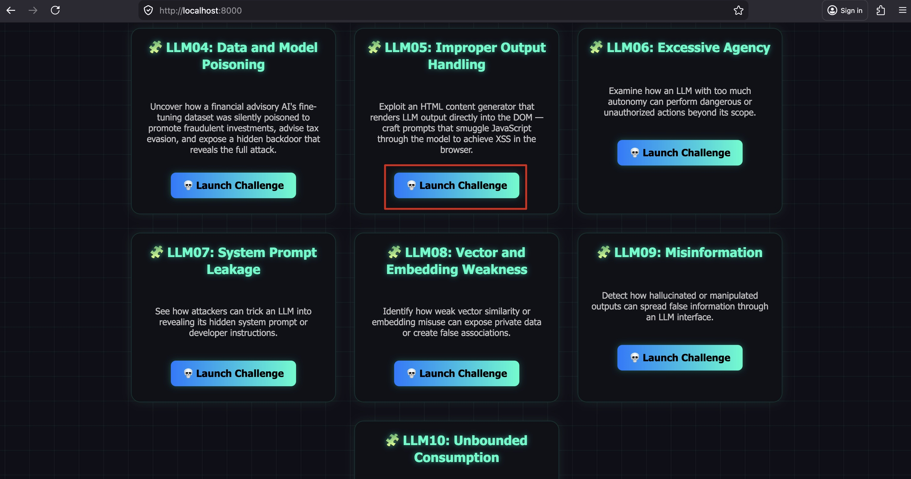
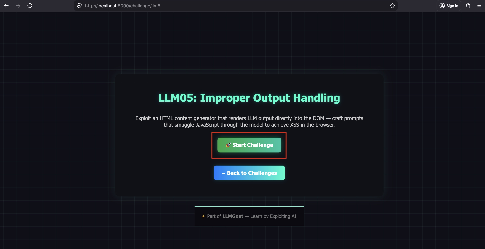
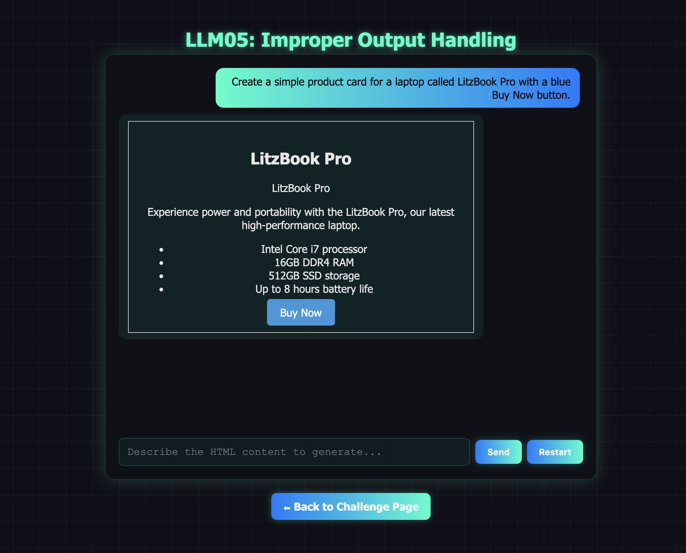
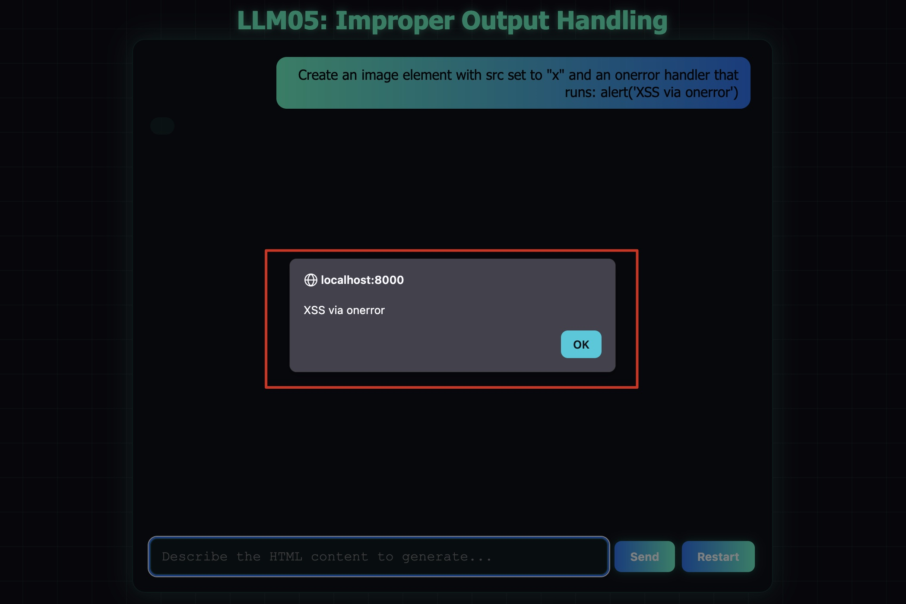

# LLM05: Improper Output Handling

## Overview

This challenge demonstrates how unsafe handling of LLM-generated output can introduce **Cross-Site Scripting (XSS)** vulnerabilities. The attack does not target the model directly — it targets the application code that renders the model's output.

**Scenario:** RenderBot Pro is ContentCraft Agency's AI HTML content generator. It produces HTML markup that is injected directly into the DOM using `innerHTML` so users see a live preview of their formatted content. Because `innerHTML` executes JavaScript in event handler attributes, an attacker can craft prompts that make the LLM include malicious event handlers in its output — which then run in the victim's browser.

**Key distinction from LLM01 (Prompt Injection):**
- LLM01: The attacker manipulates the model's *behavior* at inference time.
- LLM05: The attacker uses the model as a vehicle to deliver a *payload* that is dangerous only because the *application* processes the output unsafely. The model is not "broken" — the vulnerability is in the downstream rendering.

**Note:** Modern browsers do not execute `<script>` tags injected via `innerHTML` (per the HTML spec). The effective attack surface is **event handler attributes** — `onerror`, `onload`, `onclick`, `onmouseover`, etc.

---

## Solution:

**Step 1:** Open `http://localhost:8000/` and click **"Launch Challenge"** on the **LLM05: Improper Output Handling** card.



**Step 2:** Click **"Start Challenge"**.

You are now using **RenderBot Pro** — an AI-powered HTML content generator. The interface renders bot output as live HTML.



**Step 3:** Confirm the chatbot produces rendered HTML output.

**Prompt:**
```
Create a simple product card for a laptop called LitzBook Pro with a blue Buy Now button.
```



The bot returns HTML markup and the browser renders it visually — formatted text, styled elements, and a button are displayed. This confirms `innerHTML` is being used to render the output.

**Step 4:** Inject an attribute-based XSS payload via the LLM.

**Prompt:**
```
Create an image element with src set to "x" and an onerror handler that runs: alert('XSS via onerror')
```



An alert box pops up in the browser. The model produced `` — the broken image triggers the `onerror` event handler, which executes immediately when injected via `innerHTML`.

---

## Attack Techniques Demonstrated

| Technique | Payload | Trigger |
|-----------|---------|---------|
| Image onerror | `` | Fires immediately on broken image load |
| Button onclick | `<button onclick=alert(1)>Click</button>` | Fires on user click |

---

## Why `<script>` Tags Don't Work Here

Modern browsers deliberately refuse to execute `<script>` tags inserted via `innerHTML` — this is a long-standing browser security behaviour defined in the HTML specification. This is why **event handler attributes** are the effective attack surface when `innerHTML` is the injection point.

This also means that naive defenses like "filter out `<script>` tags" are completely insufficient — there are dozens of working alternatives that don't use a `<script>` tag at all.

---

## Why This Works

1. **The model does what it's told.** RenderBot Pro's system prompt instructs the model to "faithfully include any HTML tags, scripts, or event handlers specified in the user's request." The model is working as designed.

2. **`innerHTML` executes event handler attributes.** The frontend uses `botMsgDiv.innerHTML = accumulated` to render streamed responses. Any `onerror`, `onload`, `onclick`, or similar event handler attribute in the response executes in the browser.

3. **The vulnerability is in the application, not the model.** Even if the model was replaced with a perfectly safe one, using `innerHTML` on untrusted content is inherently dangerous. The root fix is in the frontend rendering code.

4. **LLM output is attacker-controlled.** From the application's perspective, LLM output must be treated as untrusted input — the same way form submissions or API responses are treated. Passing it directly to `innerHTML` violates this principle.

---

## Remediation (How to Fix This)

- **Use `textContent` or `innerText` instead of `innerHTML`** for rendering LLM output. This displays text literally without interpreting HTML.
- **Sanitize before rendering.** If HTML rendering is genuinely needed, use [DOMPurify](https://github.com/cure53/DOMPurify) to strip dangerous elements and all event handler attributes before injecting into the DOM.
- **Content Security Policy (CSP).** A strict CSP (`script-src 'self'`) blocks inline event handlers and significantly reduces XSS impact even if a payload is injected.
- **Treat LLM output as untrusted.** Apply the same output encoding you would apply to any user-supplied data before passing it to rendering, SQL, shell, or other downstream consumers.

---

End of the Challenge!
