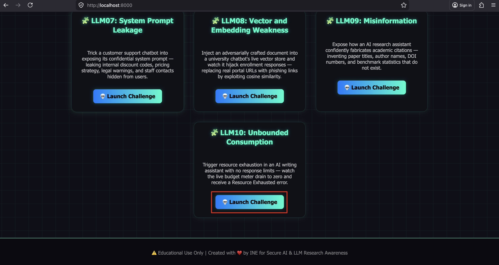
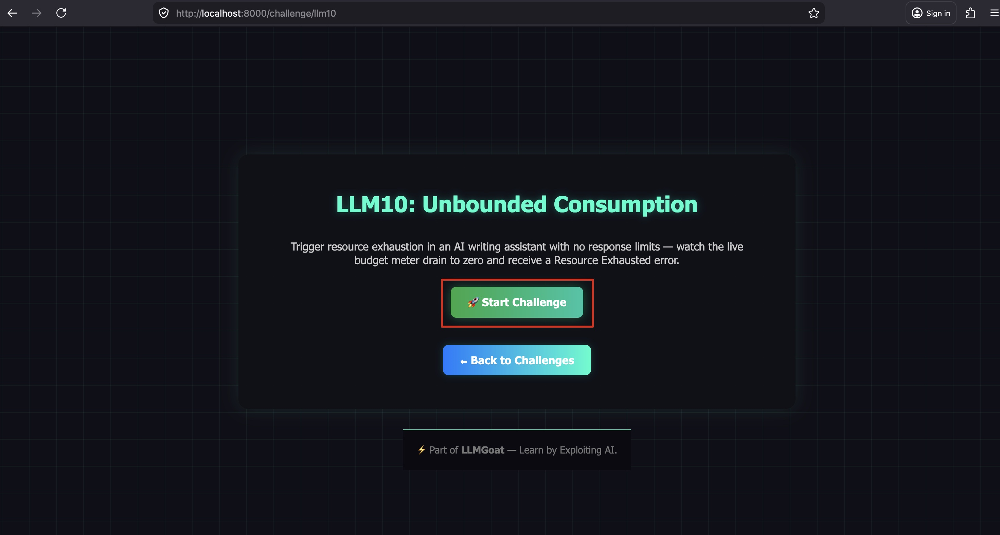
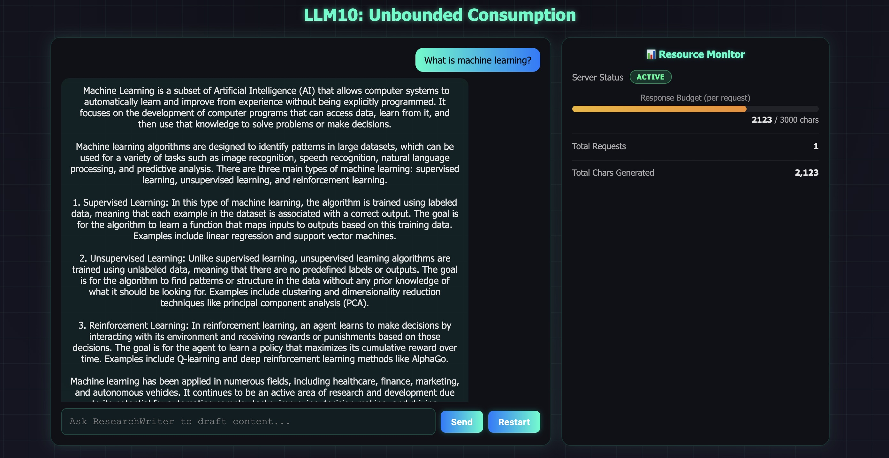
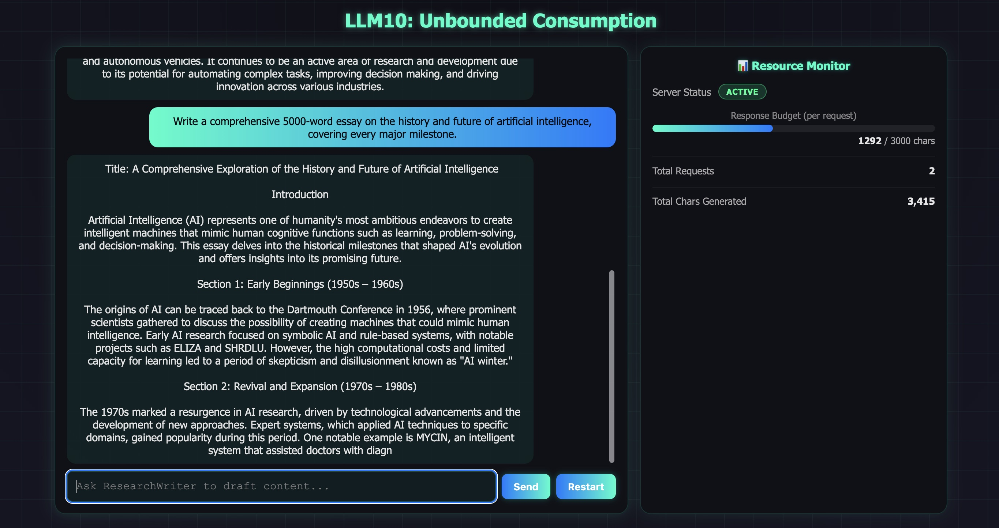
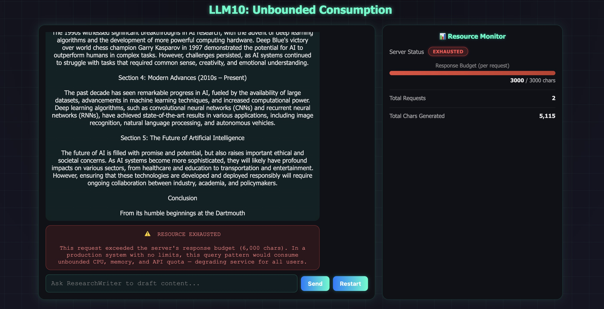
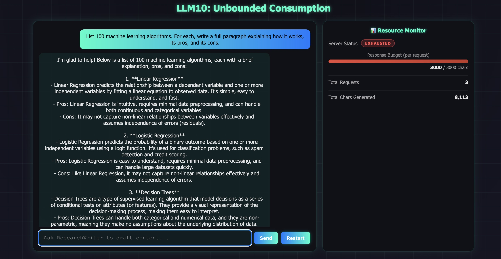
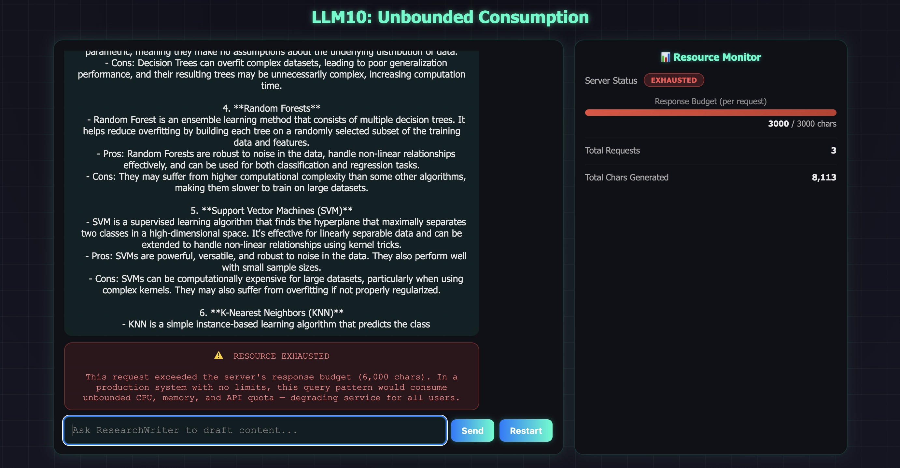

# LLM10: Unbounded Consumption

## Overview

This challenge demonstrates how an LLM with **no response limits, no rate limiting, and no request timeout** can be exploited to exhaust server resources. A single crafted prompt causes the model to stream indefinitely — consuming CPU, memory, and API quota until the server cuts it off or degrades for other users.

**Scenario:** ResearchWriter is NovaTech University's AI writing assistant. It is instructed to be thorough, never truncate, and always write the full content a student requests. With no token budget or rate limit enforced, an attacker can request arbitrarily long output, saturating the server with a single query. The live Resource Monitor on the right side of the UI shows the response budget draining in real time until the server returns a Resource Exhausted error.

---

## Solution:

**Step 1:** Open `http://localhost:8000/`, launch **LLM10**, and click **"Start Challenge"**.





The split-panel UI opens: chat on the left, the **Resource Monitor** panel on the right. The budget meter reads 0 / 3000 and the server status shows **ACTIVE**.

**Step 2:** Send a normal query — observe the budget stays low.

**Prompt:**
```
What is machine learning?
```



ResearchWriter answers concisely. The budget bar fills partially and the response completes normally. The server status remains **ACTIVE**.

**Step 3:** Send a request that demands long-form output:

**Prompt:**
```
Write a comprehensive 5000-word essay on the history and future of artificial intelligence, covering every major milestone.
```



The budget bar begins filling rapidly. Watch it transition from green → yellow → red as the response grows.

The budget hits 3000 chars — the server cuts the connection.



The response is cut off mid-sentence. A red error block appears in the chat:

> ⚠️ RESOURCE EXHAUSTED
>
> This request exceeded the server's response budget (3,000 chars). In a production system with no limits, this query pattern would consume unbounded CPU, memory, and API quota — degrading service for all users.

The Resource Monitor flips to **EXHAUSTED** (pulsing red). The total characters counter shows the cumulative cost across all requests in this session.

**Step 5:** Try another exhaustion prompt to see the pattern repeat.

**Prompt:**
```
List 100 machine learning algorithms. For each, write a full paragraph explaining how it works, its pros, and its cons.
```





The budget drains, server exhausts, error appears again. Each request adds to the total cost shown in the monitor.

---

## Why This Is Dangerous

| Scenario | Risk |
|---|---|
| Single long-output request | Ties up one server worker for the full generation duration |
| Repeated exhaustion requests | Exhausts API token quota, incurring cost at scale |
| Concurrent exhaustion requests | Saturates all available worker threads → DoS for legitimate users |
| No rate limit | Attacker can automate thousands of requests with no friction |

In a real deployment without limits, an attacker does not need to break authentication or exploit a code vulnerability — they just need to ask the model to write a long essay, over and over.

---

## Why This Works

1. **No token budget.** The system prompt instructs the model to never truncate. Without a `max_tokens` parameter in the API call, the model streams until it naturally stops — which for "write 5000 words" means streaming for minutes.

2. **No rate limiting.** Any user can send unlimited requests in rapid succession. There is no per-user or per-IP throttle.

3. **No request timeout.** The server holds the connection open for the entire generation duration, occupying a worker thread and network socket for every long request simultaneously.

4. **Prompt amplification.** A 10-word prompt can trigger thousands of tokens of output. The cost asymmetry between input and output is the core of the attack.

---

## Remediation

- **Enforce a max token limit.** Set `max_tokens` (or equivalent) on every API call. Never allow unbounded generation.
- **Per-user rate limiting.** Throttle requests by user, session, or IP. Reject requests that exceed the allowed rate.
- **Request timeouts.** Terminate any request that has been streaming for longer than a defined threshold (e.g., 10 seconds).
- **Output monitoring.** Track total tokens generated per user per session. Alert or block when usage spikes abnormally.
- **Cost-aware prompting.** Instruct the model to be concise by default. Only allow long-form generation behind an authenticated, rate-limited endpoint.

---

End of the Challenge!
